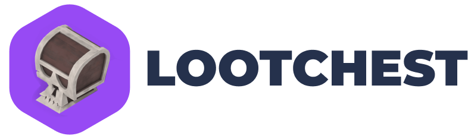

<a name="readme-top"></a>

[![LinkedIn][linkedin-shield]][linkedin-url]

<br />
<div align="center">
  <a href="hhttps://lootchest.lol/">
    
  </a>

  <p align="center">
    A content management system for the Lootchest exerpience
    <br />
    <br />
    <a href="https://lootchest.lol/">View Site</a>
    ·
    <a href="https://github.com/vinnyhoward/loot-chest-cms/issues">Report Bug</a>
    ·
    <a href="https://github.com/vinnyhoward/loot-chest-cms/issues">Request Feature</a>
  </p>
</div>

<details>
  <summary>Table of Contents</summary>
  <ol>
    <li>
      <a href="#about-the-project">About The Project</a>
      <ul>
        <li><a href="#built-with">Built With</a></li>
      </ul>
    </li>
    <li>
      <a href="#getting-started">Getting Started</a>
      <ul>
        <li><a href="#prerequisites">Prerequisites</a></li>
        <li><a href="#installation">Installation</a></li>
      </ul>
    </li>
    <li><a href="#license">License</a></li>
    <li><a href="#contact">Contact</a></li>
  </ol>
</details>

## About The Project

[![Product Name Screen Shot][product-screenshot]](/assets/images/product_image.png)

This repository houses the Sanity CMS setup for the Chest Opening Experience, providing a structured content backend that powers the dynamic and interactive elements of the game. It allows for seamless content updates, management of chest items, and configuration of rewards, ensuring a fresh and engaging experience for users.

### Built With

This project is built with [Sanity.io](https://www.sanity.io/), a unified content platform that delivers structured content to digital experiences. Sanity.io is chosen for its real-time collaboration features, extensibility, and efficient content delivery.

<p align="right">(<a href="#readme-top">back to top</a>)</p>

## Getting Started

To get a local copy up and running, follow these simple steps.

### Prerequisites

Ensure you have either Node.js or Bun installed on your system to manage project dependencies and run the development server.

- For Node.js, download and install it from [nodejs.org](https://nodejs.org/).
- For Bun, you can install it by running the following in your terminal (visit [bun.sh](https://bun.sh/) for more details):

```sh
curl https://bun.sh/install | bash
```

## Installation

1. Clone the repository to get a local copy of the project:

```sh
git clone https://github.com/vinnyhoward/loot-chest-cms.git
cd loot-chest
```

2. Install dependencies using either npm (Node.js) or Bun. Choose the command based on your preference:

Using npm:

```sh
npm install
```

Using Bun:

```sh
bun install
```

3. Configure environment variables by creating a .env file in the root directory of the project. Fill it with your specific values based on the provided .env template:

```makefile
SANITY_STUDIO_API_PROJECT_ID=<SANITY_STUDIO_API_PROJECT_ID>
SANITY_STUDIO_API_PROJECT_ID=<SANITY_STUDIO_API_PROJECT_ID>
```

Set up your environment variables: Rename the .env.example file to .env and update it with your specifics.

- PORT: The port your local server will run on (e.g., 3000).

- VITE_API_URL: Your backend API URL. Replace `<your_api_url>` with the actual API URL.

- VITE_SANITY_PROJECT_ID and VITE_SANITY_DATASET: Replace `<your_sanity_project_id>` and `<your_sanity_dataset>` with your Sanity project ID and dataset name. These are necessary for connecting to Sanity.io.

Visit the [backend repository](https://github.com/vinnyhoward/loot-chest-backend) for instructions on setting up your `<your_api_url>`.

Visit the [cms repository](https://github.com/vinnyhoward/loot-chest-cms) for instructions on setting up your Sanity environment started.


4. Run the development server to start the project locally. Use the corresponding command for your chosen package manager:

Using npm:

```sh
npm run dev
```

Using Bun:

```sh
bun run dev
```

Access the application by navigating to http://localhost:3333/ in your web browser (or another port if you specified a different one in your .env file).

<p align="right">(<a href="#readme-top">back to top</a>)</p>

## License

Distributed under the MIT License. See `LICENSE.txt` for more information.

<p align="right">(<a href="#readme-top">back to top</a>)</p>

## Contact

Vincent Howard - [@NiftyDeveloper](https://twitter.com/NiftyDeveloper) - vincenguyenhoward@gmail.com

Project Link: [https://github.com/vinnyhoward/loot-chest](https://github.com/vinnyhoward/loot-chest)

<p align="right">(<a href="#readme-top">back to top</a>)</p>


[contributors-shield]: https://img.shields.io/github/contributors/othneildrew/Best-README-Template.svg?style=for-the-badge
[contributors-url]: https://github.com/othneildrew/Best-README-Template/graphs/contributors
[forks-shield]: https://img.shields.io/github/forks/othneildrew/Best-README-Template.svg?style=for-the-badge
[forks-url]: https://github.com/othneildrew/Best-README-Template/network/members
[stars-shield]: https://img.shields.io/github/stars/othneildrew/Best-README-Template.svg?style=for-the-badge
[stars-url]: https://github.com/othneildrew/Best-README-Template/stargazers
[issues-shield]: https://img.shields.io/github/issues/othneildrew/Best-README-Template.svg?style=for-the-badge
[issues-url]: https://github.com/othneildrew/Best-README-Template/issues
[license-shield]: https://img.shields.io/github/license/othneildrew/Best-README-Template.svg?style=for-the-badge
[license-url]: https://github.com/othneildrew/Best-README-Template/blob/master/LICENSE.txt
[linkedin-shield]: https://img.shields.io/badge/-LinkedIn-black.svg?style=for-the-badge&logo=linkedin&colorB=555
[linkedin-url]: https://www.linkedin.com/in/vinnyhoward/
[product-screenshot]: assets/images/product_image.png
[Next.js]: https://img.shields.io/badge/next.js-000000?style=for-the-badge&logo=nextdotjs&logoColor=white
[Next-url]: https://nextjs.org/
[React.js]: https://img.shields.io/badge/React-20232A?style=for-the-badge&logo=react&logoColor=61DAFB
[React-url]: https://reactjs.org/
[Vue.js]: https://img.shields.io/badge/Vue.js-35495E?style=for-the-badge&logo=vuedotjs&logoColor=4FC08D
[Vue-url]: https://vuejs.org/
[Angular.io]: https://img.shields.io/badge/Angular-DD0031?style=for-the-badge&logo=angular&logoColor=white
[Angular-url]: https://angular.io/
[Svelte.dev]: https://img.shields.io/badge/Svelte-4A4A55?style=for-the-badge&logo=svelte&logoColor=FF3E00
[Svelte-url]: https://svelte.dev/
[Laravel.com]: https://img.shields.io/badge/Laravel-FF2D20?style=for-the-badge&logo=laravel&logoColor=white
[Laravel-url]: https://laravel.com
[Bootstrap.com]: https://img.shields.io/badge/Bootstrap-563D7C?style=for-the-badge&logo=bootstrap&logoColor=white
[Bootstrap-url]: https://getbootstrap.com
[JQuery.com]: https://img.shields.io/badge/jQuery-0769AD?style=for-the-badge&logo=jquery&logoColor=white
[JQuery-url]: https://jquery.com 
[Vite.js]: https://img.shields.io/badge/vite-%23646CFF.svg?style=for-the-badge&logo=vite&logoColor=white
[vite-url ]: https://vitejs.dev/
[Typescript]: https://img.shields.io/badge/typescript-%23007ACC.svg?style=for-the-badge&logo=typescript&logoColor=white
[ts-url ]: https://www.typescriptlang.org/
[Three.js]: https://img.shields.io/badge/threejs-black?style=for-the-badge&logo=three.js&logoColor=white
[three-url]: https://threejs.org/
[bun-url]: https://bun.sh/
[Bun.js]: https://img.shields.io/badge/bun-282a36?style=for-the-badge&logo=bun&logoColor=fbf0df
[Sanity.io]: https://img.shields.io/badge/Sanity.io-black?style=for-the-badge&logo=sanity&logoColor=white
[sanity-url]: https://www.sanity.io/